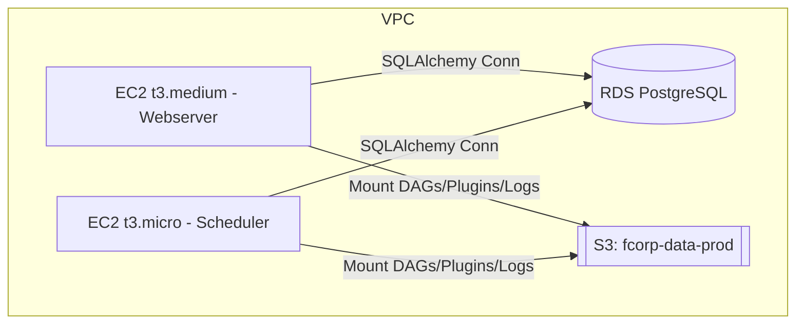
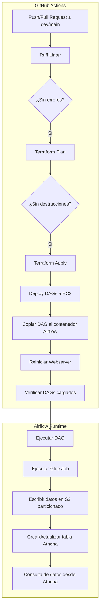

# Data Analytics Pipeline

## 📌 Description
This repository contains an end-to-end data analytics pipelines for data analytics, leveraging AWS and Airflow (MWAA) for orchestration. The project enables data integration, storage, transformation, and visualization


## 📦 Key Components

| Component         | Description                                                               |
|------------------|---------------------------------------------------------------------------|
| `Airflow on EC2` | Main orchestrator, deployed via Docker Compose on an EC2 instance.        |
| `Terraform`      | Defines and manages all infrastructure (EC2, roles, S3, Glue Jobs, etc.)   |
| `Glue Jobs`      | PySpark-based ETL scripts for transformation and aggregation.              |
| `Athena`         | Query engine for processed data.                                           |
| `GitHub Actions` | Automates DAG deployment and infrastructure validation/apply pipelines.    |


## 📂 Repository Structure
```
marketing-analytics-pipeline/
│── dags/                     # Airflow (MWAA) DAGs for orchestration
│── scripts/                   # Data generation and ETL scripts
│── config/                    # Configurations and credentials (DO NOT include real credentials)
│── notebooks/                 # Jupyter Notebooks for exploratory analysis
│── sql/                       # SQL queries for analysis
│── reports/                   # Generated reports and dashboards
│── visualization/             # Visualization scripts with QuickSight or Power BI
│── docs/                      # Project documentation
│── tests/                     # Unit and integration tests
├── jobs/
│   ├── social-media-mktg/
│   │   └── social-media-big-tbl.py  # Código del Glue Job
│   └── ...   
│── build/                     # lambda functions zip Packages
│── functions/                 # Lambda functions
│       └── function/
│           └── lambda_function.py
├── infra/
│   └── terraform/
│       ├── main.tf                  # Entrada general (proveedores, backend)
│       ├── variables.tf             # Variables globales
│       ├── terraform.tfvars         # Valores específicos del entorno
│       ├── outputs.tf               # Valores de salida útiles
│       ├── backend.tf               # (opcional) configuración del backend remoto
│       ├── provider.tf              # (opcional) definición de proveedor AWS
│       ├── glue_jobs.tf             # Declaración de todos los Glue Jobs
│       ├── lambdas.tf               # Declaración de funciones Lambda
│       ├── mwaa.tf                  # Declaración de entorno MWAA (más adelante)
│       ├── iam.tf                   # Roles y políticas IAM
│       ├── s3_objects.tf            # Carga de scripts Glue/Lambda a S3
│       └── .terraform/              # Plugins (IGNORAR en git)
│       └── .terraform.lock.hcl      # Lock de proveedores (✅ versionar)
│
│── config/      
│── .gitignore                 # Files to ignore in Git
│── requirements.txt           # Python dependencies
│── Dockerfile                 # Docker setup
│── setup.py                   # Custom package installation
```
---
## Airflow Architecture

---

### Component Overview

| Component        | Description                                                                 |
|------------------|-----------------------------------------------------------------------------|
| **EC2 Webserver**| `t3.medium` instance running `airflow-webserver` via Docker Compose         |
| **EC2 Scheduler**| `t3.micro` instance running `airflow-scheduler` via Docker Compose          |
| **RDS PostgreSQL**| `db.t3.micro` instance used as Airflow metadata database                   |
| **S3 Bucket**    | Stores scripts, DAGs, logs, and Athena output                               |
| **Security Group**| Allows ports: `22` (SSH), `8080` (UI), `5432` (RDS), `8793` (RPC)          |

---

## 🧩 Component Configuration Details

### EC2 Instances

- AMI: Amazon Linux 2 (`ami-0c02fb55956c7d316`)
- Docker and Docker Compose installed via `user_data`
- Directory structure:
  ```
  /home/ec2-user/airflow/
  ├── dags/
  ├── logs/
  ├── plugins/
  └── docker-compose.yaml
  ```
- `prevent_destroy = true` used to prevent accidental deletions
- IAM profile with permissions for Glue, S3, Athena, etc.

### Docker Compose

- Airflow 2.9 using `LocalExecutor`
- Webserver exposes port `8080`
- DAGs, logs, plugins are mounted as Docker volumes

### RDS PostgreSQL

- DB name: `airflow`
- Username: `airflow`
- Port: `5432`
- Accessible only from EC2 instances within the same VPC
- Encryption and backups are **disabled** (for demo/testing)

---

## 🛠️ Execution Flow



---

## ⚙️ Infrastructure with Terraform

- Modular and scalable (`iam.tf`, `glue_jobs.tf`, `ec2.tf`, etc.)
- Deployment commands:
  ```bash
  terraform init
  terraform plan
  terraform apply
  ```

- Secrets and variables (e.g., `TF_VAR_public_key`) are passed via GitHub Actions Secrets or `terraform.tfvars`.

- Example Glue Job definition:
  ```hcl
  resource "aws_glue_job" "data_transform" {
    name     = "data-transform-job"
    script_location = "s3://${var.bucket}/scripts/glue/transform.py"
    ...
  }
  ```

---


## 🔁 GitHub Actions Automation

### DAG Deployment Workflow

- Runs on push to `main`
- Steps:
  - Ruff linter validation
  - SCP to EC2 using `appleboy/scp-action`
  - Copy DAGs into the Docker container
  - Restart Airflow webserver
  - Check for DAG import or execution errors

### Terraform Plan & Apply Workflow

- Runs on pull request to `main`
- Steps:
  - Executes `terraform plan`
  - Highlights destructive changes
  - If approved or no changes, applies infrastructure with `terraform apply`

---

## ✳️ Adding a New Glue Job

1. Place the script in `jobs/{folder}/my_glue_job.py`
2. Upload via Terraform:

```hcl
resource "aws_s3_object" "glue_script" {
  bucket = var.glue_bucket
  key    = "scripts/glue/my_glue_job.py"
  source = "../../jobs/{folder}/my_glue_job.py"
}
```

3. Register the Glue Job:

```hcl
resource "aws_glue_job" "my_job" {
  name     = "my-glue-job"
  role_arn = aws_iam_role.glue_role.arn

  command {
    name            = "glueetl"
    script_location = "s3://${var.glue_bucket}/scripts/glue/my_glue_job.py"
    python_version  = "3"
  }

  glue_version       = "4.0"
  worker_type        = "G.1X"
  number_of_workers  = 2

  default_arguments = {
    "--INPUT_PATH"  = "s3://fcorp-data-prod/raw/..."
    "--OUTPUT_PATH" = "s3://fcorp-data-prod/consumption/..."
  }
}
```
---

### ⚙️ How It Works

- `dags/`:  
  This folder includes **Airflow DAGs** that define pipeline logic using operators like `PythonOperator`, `AthenaOperator`, and `S3DeleteObjectsOperator`.

- `jobs/`:  
  This directory holds **custom Python scripts** used by DAGs—such as file simulation, Glue client wrappers, data preprocessing, etc. These are imported by your DAGs or mounted into the containers.

- `infra/terraform/`:  
  Contains all the **Terraform modules and configurations** that provision:
  - EC2 instances (webserver + scheduler)
  - RDS PostgreSQL (Airflow metadata DB)
  - VPC, Subnets, Internet Gateway
  - IAM Roles & Instance Profiles
  - S3 Buckets

- `.github/workflows/`:  
  This contains the **GitHub Actions pipelines** that automate:
  - Code linting (Ruff)
  - DAG deployment to EC2 (via SSH + Docker)
  - Terraform plan & apply with protection against destructive changes
  - DAG validation after deployment

---

### 🔁 Deployment Flow

1. You push changes to the `main` branch.
2. GitHub Actions runs:
   - **Linting** with `ruff`
   - **Copying DAGs** to the webserver and scheduler EC2 instances
   - **Triggering DAG reloads** inside Docker containers
   - **Running Terraform** to update infrastructure (only applies if safe)

3. Any change to DAG logic, scripts, or infrastructure is immediately deployed and available.

---

## ✅ Key Features

- DAGs are synced across EC2 nodes to ensure consistency
- Glue jobs and Athena queries are defined as part of DAGs
- All AWS resources are version-controlled via Terraform
- CI/CD provides safe and reproducible deployments
- DAGs are validated automatically after each push

---

## 🔐 Security and Good Practices

- IAM instance profile with limited permissions
- Secrets handled via GitHub Actions (`EC2_HOST`, `SSH_KEY`, `AWS_ACCESS_KEY`, etc.)
- EC2 instances live in public subnets (for simplicity)
- `prevent_destroy` enabled on EC2 instances
- Use of `vpc_security_group_ids` instead of `security_groups` to avoid EC2 replacement
- CI/CD checks for destructive changes in Terraform plan

---

## 📌 Best Practices

- Ensure all numerical columns (`campaign_id`, `impressions`, etc.) are stored with correct data types (`int`, `bigint`) in Parquet.
- Athena DDL must match the final structure emitted by Glue.
- Use `skip.header.line.count='1'` if reading CSVs.

---

## 🤝 Contributing

1. Create a new branch from `dev`
2. Open a pull request
3. Ensure:
   - Linter passes
   - Terraform plan is clean
   - DAGs load correctly in Airflow

---


## 🚀 Technologies planned for integration
- **AWS Lambda, S3, Glue, Athena** for data storage and processing.
- **Redshift, Snowflake** for structured data storage.
- **Power BI, QuickSight** for visualization and data analysis.
- **APIs from Meta, Google Ads, DV360, Snapchat, TikTok** for data ingestion.
- **Python, SQL** for data manipulation and transformation.

## 📊 Pipeline Workflow
1. **Data Ingestion**: Fetching campaign data via APIs.
2. **Storage**: Saving data in S3 and analytical databases.
3. **Transformation**: Cleaning and structuring using Glue/Athena.
4. **Loading**: Inserting data into Redshift/Snowflake for analysis.
5. **Visualization**: Creating dashboards in Power BI/QuickSight.

## 🛠 Installation & Setup
### 📌 Prerequisites
- Python 3.8+
- AWS CLI configured
- Docker (optional, for local development)
- Airflow (if running locally instead of MWAA)

### 📥 Installation
```bash
# Clone the repository
git clone https://github.com/your_user/marketing-analytics-pipeline.git
# Install dependencies
pip install -r requirements.txt
```


```bash
# install docker
docker ps -al
docker build -t jupyter-notebook-spark:latest .
docker image ls 
sh init_docker.sh
```
export TF_VAR_public_key="$(cat ~/.ssh/airflow-key-no-pass.pub)"


## 📜 License
This project is licensed under MIT. See [LICENSE](LICENSE) for more details.