# Apache Airflow Deployment – FCorp Marketing Platform

This setup orchestrates data pipelines using **Apache Airflow 2.9**, deployed on **AWS infrastructure** using **Terraform** and automated via **GitHub Actions**.

---

## 🗺️ System Architecture


### Component Overview

| Component        | Description                                                                 |
|------------------|-----------------------------------------------------------------------------|
| **EC2 Webserver**| `t3.medium` instance running `airflow-webserver` via Docker Compose         |
| **EC2 Scheduler**| `t3.micro` instance running `airflow-scheduler` via Docker Compose          |
| **RDS PostgreSQL**| `db.t3.micro` instance used as Airflow metadata database                   |
| **S3 Bucket**    | Stores scripts, DAGs, logs, and Athena output                               |
| **Security Group**| Allows ports: `22` (SSH), `8080` (UI), `5432` (RDS), `8793` (RPC)          |

---

## 🧩 Component Configuration Details

### EC2 Instances

- AMI: Amazon Linux 2 (`ami-0c02fb55956c7d316`)
- Docker and Docker Compose installed via `user_data`
- Directory structure:
  ```
  /home/ec2-user/airflow/
  ├── dags/
  ├── logs/
  ├── plugins/
  └── docker-compose.yaml
  ```
- `prevent_destroy = true` used to prevent accidental deletions
- IAM profile with permissions for Glue, S3, Athena, etc.

### Docker Compose

- Airflow 2.9 using `LocalExecutor`
- Webserver exposes port `8080`
- DAGs, logs, plugins are mounted as Docker volumes

### RDS PostgreSQL

- DB name: `airflow`
- Username: `airflow`
- Port: `5432`
- Accessible only from EC2 instances within the same VPC
- Encryption and backups are **disabled** (for demo/testing)

---

## 🔁 CI/CD Flow with GitHub Actions

```mermaid
graph TD
  A[Push to main] --> B[Run Ruff Linter]
  B --> C[Deploy DAGs to Webserver & Scheduler]
  C --> D[Validate DAGs in Webserver]
  A --> E[Terraform Init & Plan]
  E --> F[Check for resource destruction]
  F -->|Safe| G[Terraform Apply]
  F -->|Dangerous| H[❌ Abort Apply]
```



### Details:

| Stage              | Description                                                            |
|--------------------|------------------------------------------------------------------------|
| **Linting**        | Uses `ruff` to enforce Python style on DAGs                            |
| **DAG Deployment** | Uses `scp` to copy to EC2; `touch` via `find` to trigger reload        |
| **Validation**     | Lists loaded DAGs and import errors                                    |
| **Terraform Plan** | Saves plan and checks for resources marked for destruction             |
| **Protection**     | Automatically blocks `apply` if destruction is detected                |

---

## 🧪 Example DAG: `el_glue_policies_pipeline`

Simulates a full ETL pipeline for policy-related datasets using:

- **Glue Jobs**: simulate raw files, clean staging data, transform consumption data
- **Athena**: create database, create external table, repair partitions
- **S3DeleteObjectsOperator**: clean raw files from S3

### DAG Flow:


---

## 📁 Project Structure & Deployment Workflow

This repository is designed to orchestrate data pipelines and infrastructure using **Apache Airflow**, **Terraform**, and **GitHub Actions**.

### 🧩 Folder Structure

```
.
├── dags/               # Contains all Airflow DAG definitions
├── jobs/               # Python scripts used in DAG tasks (e.g., data generators, S3 logic)
├── infra/
│   └── terraform/      # Infrastructure-as-Code for EC2, RDS, networking, IAM, etc.
├── .github/
│   └── workflows/      # GitHub Actions CI/CD pipelines
```

---

### ⚙️ How It Works

- `dags/`:  
  This folder includes **Airflow DAGs** that define pipeline logic using operators like `PythonOperator`, `AthenaOperator`, and `S3DeleteObjectsOperator`.

- `jobs/`:  
  This directory holds **custom Python scripts** used by DAGs—such as file simulation, Glue client wrappers, data preprocessing, etc. These are imported by your DAGs or mounted into the containers.

- `infra/terraform/`:  
  Contains all the **Terraform modules and configurations** that provision:
  - EC2 instances (webserver + scheduler)
  - RDS PostgreSQL (Airflow metadata DB)
  - VPC, Subnets, Internet Gateway
  - IAM Roles & Instance Profiles
  - S3 Buckets

- `.github/workflows/`:  
  This contains the **GitHub Actions pipelines** that automate:
  - Code linting (Ruff)
  - DAG deployment to EC2 (via SSH + Docker)
  - Terraform plan & apply with protection against destructive changes
  - DAG validation after deployment

---

### 🔁 Deployment Flow

1. You push changes to the `main` branch.
2. GitHub Actions runs:
   - **Linting** with `ruff`
   - **Copying DAGs** to the webserver and scheduler EC2 instances
   - **Triggering DAG reloads** inside Docker containers
   - **Running Terraform** to update infrastructure (only applies if safe)

3. Any change to DAG logic, scripts, or infrastructure is immediately deployed and available.

---

## ✅ Key Features

- DAGs are synced across EC2 nodes to ensure consistency
- Glue jobs and Athena queries are defined as part of DAGs
- All AWS resources are version-controlled via Terraform
- CI/CD provides safe and reproducible deployments
- DAGs are validated automatically after each push

---

## 🔐 Security and Good Practices

- IAM instance profile with limited permissions
- Secrets handled via GitHub Actions (`EC2_HOST`, `SSH_KEY`, `AWS_ACCESS_KEY`, etc.)
- EC2 instances live in public subnets (for simplicity)
- `prevent_destroy` enabled on EC2 instances
- Use of `vpc_security_group_ids` instead of `security_groups` to avoid EC2 replacement
- CI/CD checks for destructive changes in Terraform plan

---

## 📍 Suggested Next Improvements

- Enable encryption and automated backups for RDS
- Migrate to `CeleryExecutor` or Amazon MWAA for high availability
- Add Slack/email alerts for DAG failures
- Use S3 or Git-based DAG versioning
- Add Nginx + SSL for production-level Airflow UI access

---

## 👤 Author & Contact

> Internal project to automate marketing-related data pipelines  
> Maintained by: **Mauricio Bautista – Data Engineer**  
> GitHub Repository: `https://github.com/<your-repo>`
